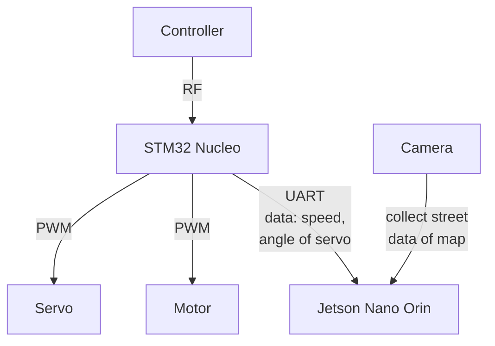

# 🚗 Bosch Future Mobility Competition 2023  
### Hardware & Firmware Development - Team Member Report  

## 👤 Team Role  
**Role:** Hardware Engineer  
**Responsibilities:**  
- In charge of all hardware systems and connections  
- Collect data and send to Team AI for processing  
- Develop firmware for STM32 and Jetson Nano Orin  
- Real-time control of autonomous car using controller

---

## ⚙️ System Overview  

### 🎮 Control System  
- **Controller:** RF-based remote  
- **Main MCU:** STM32 Nucleo  
- **Onboard PC:** Jetson Nano Orin  
- **Communication:** UART (between STM32 and Jetson Nano)
 
---
## 🔁 Hardware Communication Flow  

---
## 🔁 Hardware Communication Flow  
STM32 handles:  
- Motor (speed control)  
- Servo (steering angle)  
- Sends data to Jetson Nano Orin via UART:  
  - Speed info  
  - Servo angle

Jetson Nano Orin handles:  
- Capturing map and street data using camera  
- Processing AI tasks  
- Interacting with STM32 via UART

---

## 🧠 Contribution to Team AI  
- Provided hardware feedback (servo angle, speed)  
- Supported real-time data collection  
- Enabled AI team to train and validate models using real-world sensor data

---

## 🧾 Firmware Development  

### STM32 Nucleo  
- Controlled PWM for motor and servo  
- Used UART to send feedback data to Jetson  
- Firmware written in STM32CubeIDE (C)

### Jetson Nano Orin  
- Collected camera data for mapping  
- Parsed UART data from STM32  
- Python/C++ scripts for communication  
- Supported AI processing pipeline  

---

## 🖼️ System Image  

---

## 🎥 Controller Operation Demo  

---

## 🔧 Tools & Technologies  
- STM32CubeIDE  
- Jetson Nano SDK  
- UART Communication  
- PWM, RF Control  
- Python / C++  
## 🤖 Team AI Repository  
You can explore the AI simulator and processing code here:  
🔗 [Self-Driving Car AI Simulator](https://github.com/Hoangpham13579/self-driving-car-simulator)
